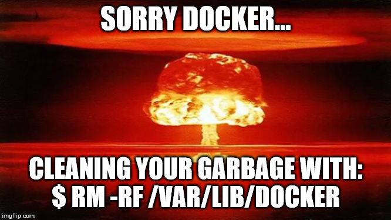

# About DockerNuke

This is a quick shell script to destroy `/var/lib/docker` and restart Docker with no images whatsoever aka ```Make Docker Clean Again```.



# Why?

I wrote it because all other approaches sucks, are not fast enough, left garbage layers, etc...

Notably ```docker prune``` does not remove everything (only what is considered
'dangling'), so I could not find any other option then nuking the whole docker directory.

# Requirements

* mv
* rm
* docker
* sudo
* systemctl

# Notes

If ```/var/lib/docker``` is on the same disk as ```/var/lib/docker.old``` (or
you don't have a dedicated disk partition for ```/var/lib/docker```), the move
operation with 'mv' should be near instant.

# Screenshot

```
$ ./dockernuke.sh
[1/4] Stopping Docker...[OK]
[2/4] Moving directory...[OK]
[3/4] Erasing old directory...[OK]
[4/4] Starting Docker...[OK]
$ 
```

# Issues

When you do it to often, you will get this error:

```
$ ./dockernuke.sh
[1/4] Stopping Docker...[OK]
[2/4] Moving directory...[OK]
[3/4] Erasing old directory...[OK]
[4/4] Starting Docker...Job for docker.service failed because start of the service was attempted too often. See "systemctl status docker.service" and "journalctl -xe" for details.
To force a start use "systemctl reset-failed docker.service" followed by "systemctl start docker.service" again.
```

# Links

* https://pypi.org/project/docker-nuke/
* https://gist.github.com/n3r0-ch/30c628813b67190d309d
* https://github.com/jwasham/docker-nuke/blob/master/docker-nuke.sh
